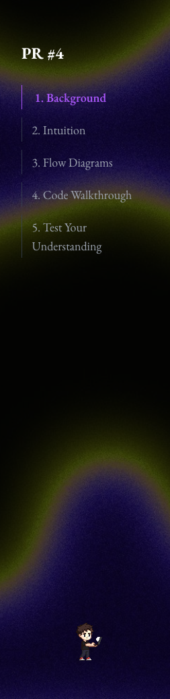

# PR Explainer AI

> Understanding is the new bottleneck.

Pull requests are where software changes hands. Yet reviews often ask people to reconstruct intent from a diff, a few filenames, and limited context.

PR Explainer AI turns a pull request into a clear, standalone learning experience: why the change exists, how the system behaves, which code paths matter, and a short quiz that checks whether the reviewer actually understood it.

It is a public GitHub Action that creates a polished interactive HTML artifact for every pull request.

Each artifact is deliberately designed as a document someone wants to read, rather than a wall of generated text:

- Business context before implementation details
- Technical intuition that explains the trade-off
- Visual diagrams for data flow and component boundaries
- A code walkthrough focused on the changed paths
- A five-question quiz with feedback



## Why this exists

Shipping code has become faster. Building shared understanding has not.

An effective review is more than approving a diff: it is the moment when a team aligns on the problem, the system behavior, and the risks of a change. That knowledge otherwise stays locked in the author’s head or disappears into a merge commit.

PR Explainer AI makes that context durable, visual, and easy to revisit.

## Add it to a pull request workflow

```yaml
name: explain-pr

on:
  pull_request:
    types: [opened, synchronize, reopened]

jobs:
  explain:
    runs-on: ubuntu-latest
    permissions:
      contents: read
      pull-requests: write

    steps:
      - uses: actions/checkout@v4
        with:
          fetch-depth: 0

      - uses: rafaeltorresng/pr-explainer-action@v1
        with:
          openrouter_api_key: ${{ secrets.OPENROUTER_API_KEY }}
          language: en
```

The Action uploads the HTML as a workflow artifact and posts a link on the PR. Use `language: pt-BR` for Brazilian Portuguese.

## Configuration

| Input | Default | Purpose |
| --- | --- | --- |
| `openrouter_api_key` | required | OpenRouter API key used for generation. |
| `language` | `en` | `en` or `pt-BR`. |
| `max_lines` | `15000` | Skip generation when the PR exceeds this change size. |
| `openrouter_model` | `deepseek/deepseek-v4-flash` | Override the OpenRouter model when needed. |
| `output_file` | `pr-explanation.html` | Generated HTML filename. |
| `artifact_name` | `pr-explanation-html` | Artifact name shown in GitHub Actions. |
| `comment_on_pr` | `true` | Post the artifact link on the pull request. |

The workflow needs `actions/checkout` with `fetch-depth: 0`. To post the PR comment, grant `pull-requests: write`.

## What runs under the hood

`git diff` → bounded diff → OpenRouter → structured explanation → standalone HTML artifact

The Action retries failed model calls, rejects malformed or incomplete JSON, and limits the diff sent to the model. The result is a single HTML document with inlined layout assets (including the quiz UI and mascot). When opened in a browser it loads Tailwind CSS and fonts from CDNs — no app or server required.

## Local verification

```bash
bun test
```

## License

MIT
